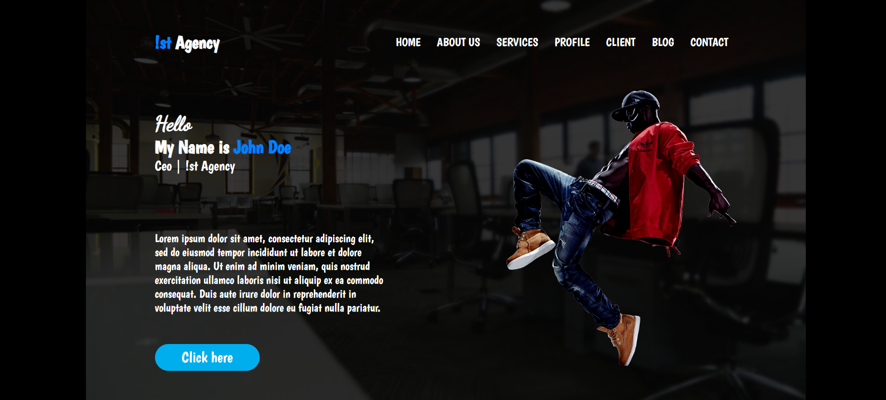

# WebDev-Challenge-23



 [Click and check it!](https://maciejspalek.github.io/WebDev-Challenge-23/)

## About the project 
The responsive website developed based on  layout from Weekly WebDev Challenge group on Facebook.

## The project created with 
 * HTML
 * BEM
 * CSS + SASS
 * JS + jQuery
 * Responsive Web Design


## Usage
```
npm start
```